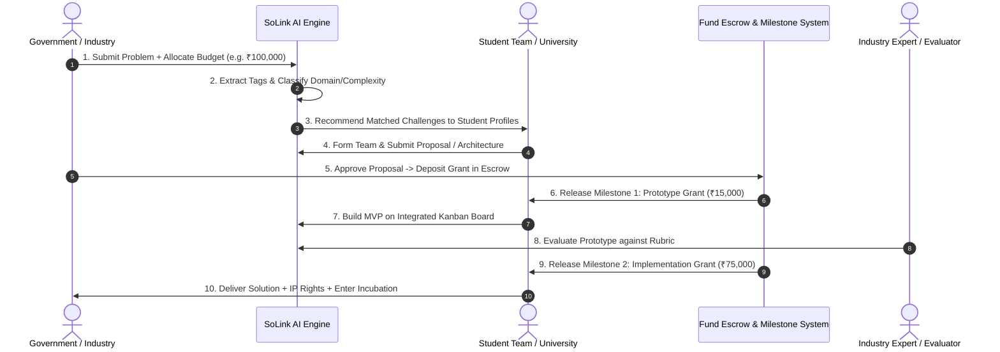

# SoLink AI — Open Innovation & Fair Value Exchange Platform
### Comprehensive Project Overview & System Specification (SIH26043)

---

## 1. Executive Summary & Core Value Proposition

**SoLink AI (SIH26043)** is an **AI-powered Open Innovation Marketplace** designed to bridge the structural gap between **Government Bodies & Industry Partners** (problem owners with R&D/innovation budgets) and **University Students & Researchers** (skilled problem solvers).

### The Gap in Traditional Platforms
Traditional hackathons and crowdsourcing boards operate under an unfair dynamic:
$$\text{Govt/Industry Posts Problem} \longrightarrow \text{Students Solve Problem for Free (Certificates)} \longrightarrow \text{Govt Retains Budget}$$

This creates an **unfair value gap**:
- Government departments retain allocated R&D/consultancy budgets while getting unpaid student labor.
- Students receive only certificates or "experience" despite delivering production-grade solutions.
- Platforms lack a transparent, long-term self-sustainability model.

### The SoLink AI Open Innovation Fix
SoLink AI restructures the ecosystem into a **fair, milestone-based value exchange**:
$$\text{Govt/Industry Budget} \longrightarrow \text{Platform SaaS Fee} + \text{Milestone Grants (Prototype/Pilot)} \longrightarrow \text{Student IP + Incubation}$$

- **Government & Industry**: Save up to 70% on traditional IT/consultancy costs while accessing parallel student innovation teams.
- **Students & Researchers**: Earn milestone-based monetary grants, retain commercialization IP rights, and gain fast-track startup incubation.
- **Platform (SoLink AI)**: Sustains itself via a transparent SaaS subscription/service fee paid by government/industry — **never by taking a cut of student grants**.

---

## 2. Comparative Analysis: Prototype Overview vs. Open Innovation Framework

| Dimension | 1st Technical Prototype Overview | 2nd Open Innovation Framework (Restructured) | Synthesized SoLink AI Model |
| :--- | :--- | :--- | :--- |
| **Core Concept** | Skill-matching and problem-routing engine connecting universities to challenges. | Open Innovation marketplace ensuring fair financial value exchange. | **AI-Powered Open Innovation Platform** with automated skill-routing and milestone-based grant escrow. |
| **Problem Onboarding** | Domain description & tag input. | Problem statement + allocated budget + impact metrics + target theme. | **Budget-Backed Problem Onboarding** with AI theme/complexity classification. |
| **Matching Engine** | Keyword/regex tag extraction scoring university profiles. | Recommendation engine factoring team availability, specialization, and track record. | **Multi-tier AI Engine**: Skill matching + university specialization + team readiness scoring. |
| **Student Incentives** | Experience, project portfolio, certificates. | Milestone grants (Prototype & Implementation), IP rights, incubation. | **Monetary Grants + IP Rights + Certificates + Startup Cell Incubation**. |
| **Execution Flow** | Task Kanban Board (`TODO`, `DOING`, `DONE`). | Staged fund release escrow with pilot implementation tracking. | **Integrated Milestone Escrow Kanban**: Task completion triggers milestone grant releases. |
| **Sustainability** | Not specified. | Government/Industry SaaS subscription / service fee. | **B2G / B2B SaaS Model** charging small percentage service fee on challenge onboarding. |

---

## 3. Restructured Problem Statement (SIH26043)

> **"Design and develop an AI-powered digital Open Innovation platform (SoLink AI) that crowdsources societal and governmental challenges from government bodies and industries, matches them with university students and researchers through an intelligent recommendation engine, and ensures fair, milestone-based value exchange — where government departments save on traditional consultancy costs, students receive monetary grants, IP rights, and incubation pathways instead of unpaid labor, and the platform sustains itself through a transparent subscription/service-fee model rather than extracting value from student work."**

---

## 4. Stakeholder Value Exchange Matrix

```
                      +----------------------------------+
                      |   Government / Industry Partner  |
                      +----------------------------------+
                                  |           ^
        Allocated R&D Budget      |           |  Low-cost, Vetted Solutions
        & Problem Statements      v           |  & Consultancy Savings
                      +----------------------------------+
                      |    SoLink AI Open Innovation     |
                      |            Platform              |
                      +----------------------------------+
                       /          |                  \
     SaaS Service Fee /           | Milestone Grants  \ Expert Guidance
                     v            v & IP Rights        v
      +------------------+   +-------------------+   +--------------------+
      |  Platform Infra  |   | Student Teams &   |   | Mentors & Industry |
      |  & Sustainability|   | University Labs   |   | Experts            |
      +------------------+   +-------------------+   +--------------------+
```

| Stakeholder | What They Provide | What They Receive |
| :--- | :--- | :--- |
| **Government / Industry** | Challenge descriptions, domain parameters, and allocated R&D/innovation budget. | Vetted, tested, low-cost solutions; up to 70% savings vs traditional consultancies; rapid multi-team prototyping. |
| **Students & Researchers** | Technical skills, time, innovative solution design, and prototype execution. | **Milestone-based monetary grants**, non-exclusive IP commercialization rights, official certification, and startup cell incubation. |
| **Mentors & Experts** | Project evaluation, technical guidance, code review, and domain advisory. | Expert recognition, corporate CSR/ESG credits, and direct access to top-tier technical talent. |
| **SoLink AI Platform** | Matching AI engine, fund escrow tracking, Kanban collaboration tools, pilot analytics. | Transparent SaaS subscription & service fees charged to problem publishers. |

---

## 5. End-to-End System & Fund Flow Architecture



---

## 6. Core Modules Breakdown

### Module 1: Auth & Role-Based Access Control (RBAC)
- **Roles**: `Government/Industry Publisher`, `Student Developer`, `Faculty Mentor`, `Platform Admin`.
- **Functionality**: Secure JWT authentication, profile verification, university affiliation mapping.

### Module 2: Open Innovation Problem & Budget Onboarding
- **Functionality**: Publishers input problem title, description, domain tags, target deadline, and **allocated budget**.
- **AI Auto-Classification**: Classifies challenge under themes (Disaster Mgmt, Healthcare, Agriculture, Smart Cities) and assesses complexity.

### Module 3: AI Matching & Recommendation Engine (`server/src/lib/matching.ts`)
- **Functionality**: 
  - `extractTags(text)`: AI/NLP keyword & domain skill extraction.
  - `scoreUniversity(university, tags)`: Scores university capability based on faculty specialization and student skill matrices.
  - Generates transparent match percentage breakdowns for problem authors.

### Module 4: Cross-University Team Formation & Proposal Submission
- **Functionality**: Students create cross-disciplinary or cross-university teams, review matched problems, and submit technical proposals (architecture, tech stack, timeline).

### Module 5: Milestone Fund Escrow & Grant Release Tracker
- **Functionality**:
  - **Milestone 1 — Prototype Seed Grant**: Released upon proposal selection to build the MVP.
  - **Milestone 2 — Pilot/Implementation Grant**: Released upon clearing mentor/reviewer rubric evaluation.
  - Transparent transaction audit logging for government financial auditing.

### Module 6: Evaluation & Expert Mentorship Hub
- **Functionality**: Rubric-based scoring (Feasibility, Innovation, Impact, Scalability) and integrated mentor booking for feedback sessions.

### Module 7: Kanban Implementation & Pilot Tracking (`client/src/App.jsx`)
- **Functionality**: Interactive task management board (`TODO` $\rightarrow$ `DOING` $\rightarrow$ `DONE`).
- Progress markers automatically update government problem dashboards in real time.

### Module 8: Open Innovation Analytics Dashboard
- **Functionality**: Admin and Government views tracking platform-wide KPIs: total cost saved, active grants distributed, problems solved, IP filings, and incubation conversion rate.

---

## 7. Technical Implementation & Data Schema

### Database Schema Alignment (`server/prisma/schema.prisma`)

```prisma
model Problem {
  id            String        @id @default(cuid())
  org           String
  domain        String
  description   String
  budget        Float         @default(0.0)
  status        ProblemStatus @default(SUBMITTED)
  extractedTags String[]      @default([])
  createdAt     DateTime      @default(now())
  updatedAt     DateTime      @updatedAt

  routedTo      University?   @relation("RoutedProblems", fields: [routedToId], references: [id])
  routedToId    String?

  matches       Match[]
  tasks         Task[]
  grants        MilestoneGrant[]
}

enum GrantStatus {
  LOCKED
  ESCROWED
  RELEASED
}

model MilestoneGrant {
  id          String      @id @default(cuid())
  problem     Problem     @relation(fields: [problemId], references: [id], onDelete: Cascade)
  problemId   String
  title       String      // e.g. "Milestone 1: Prototype Grant"
  amount      Float
  status      GrantStatus @default(LOCKED)
  releasedAt  DateTime?
}

enum TaskColumn {
  TODO
  DOING
  DONE
}

model Task {
  id        String     @id @default(cuid())
  problem   Problem    @relation(fields: [problemId], references: [id], onDelete: Cascade)
  problemId String
  title     String
  column    TaskColumn @default(TODO)
  createdAt DateTime   @default(now())
}
```

---

## 8. Pitch & Key Takeaway for Evaluation

> **"SoLink AI doesn't just crowdsource problems — it crowdsources fair value exchange. Government and industry save up to 70% on traditional consultancy costs, students earn real monetary grants and IP rights instead of unpaid labor, and the platform sustains itself through transparent service fees — not by monetizing student effort."**
